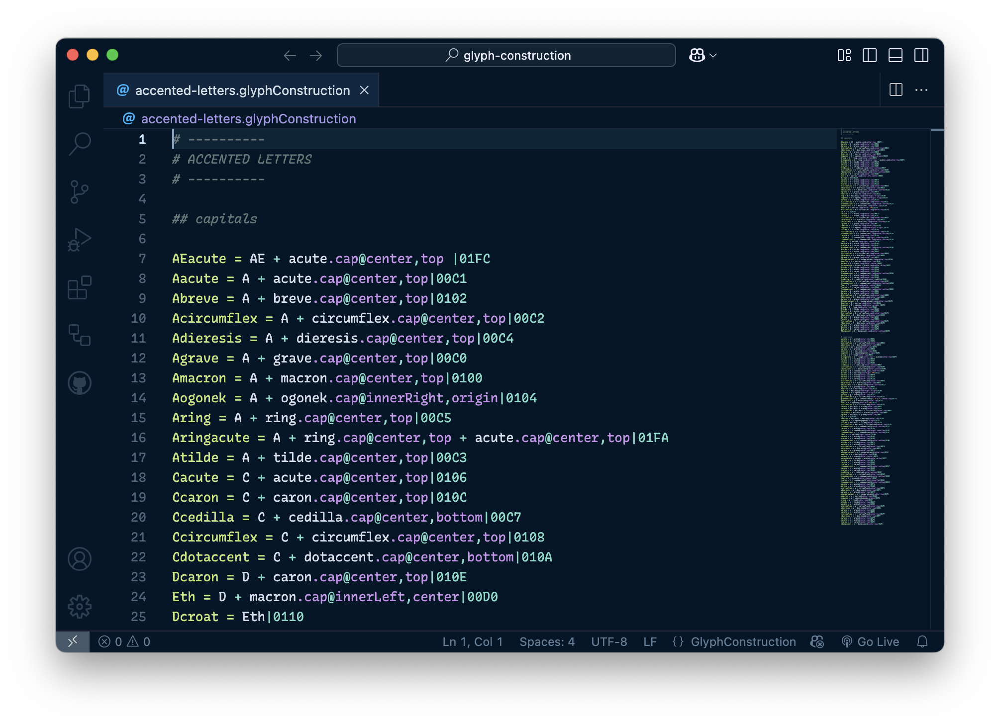

# Glyph Construction for VSCode

**This VS Code extension provides syntax-highlighting and snippets for the [Glyph Construction](https://github.com/typemytype/GlyphConstruction#readme) files, that can be used in RoboFont, FontLab and FontForge.**

> _"Glyph Construction is a simple, powerful, human-readable language for describing how glyph shapes are built."_

## Features

- **Syntax-highlighting** for the `*.glyphConstruction` and `*.gc` files
- **Snippets**
    - Font dimension attributes: `descender`, `xHeight`, `capHeight`, `ascender`
    - Calculated reference positions: `top`, `bottom`, `left`, `right`, `innerLeft`, `innerRight`, `center`, `origin`, `width`
    - Color mark syntax (prefix: _color-mark_ or _cm_): `! 0, 0, 0, 1`
    - Transformation matrix syntax (prefix: _matrix_): `1, 0, 0, 1, 0, 0`
    - Comment variables: `OverwriteExistingGlyphs`, `AutoUnicodes`, `MarkGlyphs`, `AutoHint`, `UnlinkRmOvrlpFlag` (the last 2 are for FontForge only)